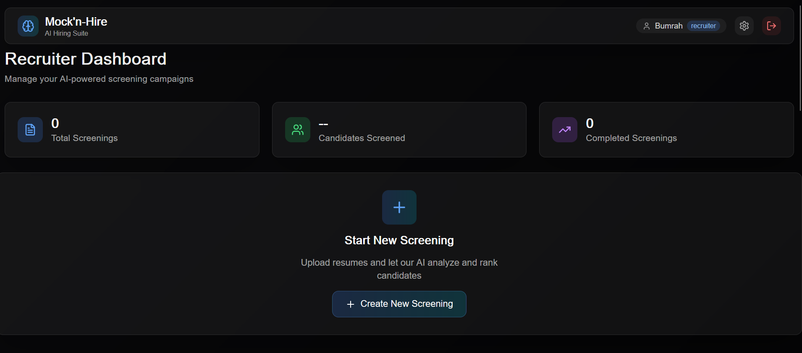
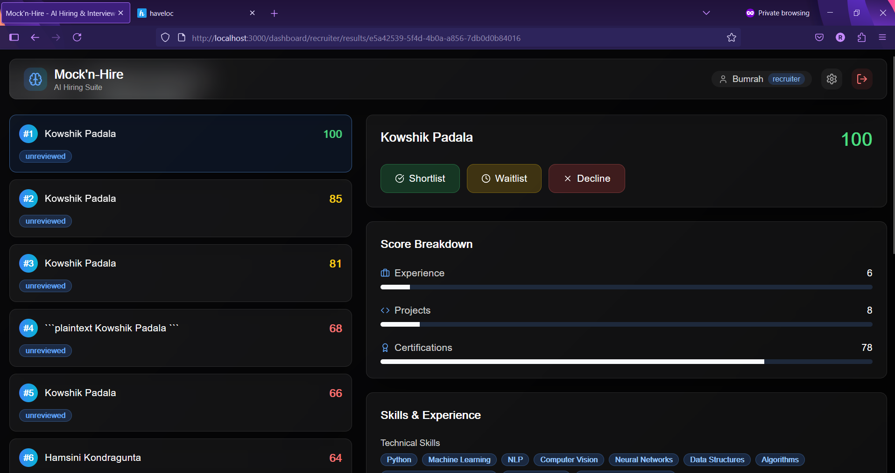

# Mock’n‑Hire — AI‑Powered Hiring Suite

[](https://16icccnt.com/)
[](#-license)

**Mock’n‑Hire** streamlines hiring end‑to‑end: it semantically ranks resumes against a job description and delivers real‑time, emotion‑aware feedback during mock interviews. Recruiters get configurable, bias‑resistant rankings; candidates get targeted practice and actionable insights.

---

## 🔎 At a Glance

- **AI Resume Ranking** — Goes beyond keyword matching using LLM‑powered semantic scoring aligned to a role’s requirements.
- **Custom Weights for Recruiters** — Tune the importance of Experience, Projects, Certifications, etc., per role.
- **Personalized Mock Interviews** — Questions are generated from each candidate’s own resume (technical / HR / situational).
- **Real‑Time Emotion & Stress Analysis** — A MobileNetV2‑based model analyzes video responses and surfaces objective cues.
- **Unified Dashboards** — Recruiters manage screenings; candidates practice and review detailed reports.
- **Measured Performance** — Internal evaluations report ~86.4% precision@10 for resume selection and >82% accuracy in stress identification on a held‑out set. *(Replace with your latest numbers or link to your paper/report.)*

> 📣 **Accepted at ICCCNT 2025** — 16th International Conference on Computing, Communication and Networking Technologies (ICCCNT 2025).

---

## 📸 Screenshots

| Recruiter Dashboard | Candidate Screening & Analysis |
| :---: | :---: |
|  |  |

> Ensure these images exist at the project root or update paths accordingly.

---

## 🏗 Architecture Overview

```
[Recruiter UI (Next.js/React)]
        │
        ▼
[FastAPI Backend] ──► [LLM Resume Ranking + Scoring]
        │                         │
        │                         └─► [Custom Weights per Role]
        │
        ├─► [/interview/questions]  (resume‑aware question generation)
        └─► [/interview/analyze]    (MobileNetV2 emotion/stress inference)

[Supabase: Auth + PostgreSQL + Storage]
        ▲
        │
[Candidate UI (Next.js/React)] ──► Mock interview capture & analytics
```

**Key Roles**  
- **Recruiters** upload JDs & resumes, configure weights, and review ranked shortlists.  
- **Candidates** practice with generated questions; receive real‑time feedback and post‑session analytics.

---

## 🧰 Tech Stack

| Category | Technologies |
| :--- | :--- |
| **Frontend** | Next.js, React, Tailwind CSS |
| **Backend** | Python, FastAPI |
| **AI/ML** | LLMs (e.g., Mistral‑8x7B), Sentence Transformers, MobileNetV2, TensorFlow |
| **Data & Cloud** | Supabase (Auth, PostgreSQL, Storage) |

> Swap LLMs/providers as needed (e.g., OpenAI, local via Ollama).

---

## 🚀 Getting Started (Local)

### Prerequisites
- Python **3.9+**
- Node.js **18+** and npm
- A **Supabase** project (URL + keys)
- (Recommended) **FFmpeg** for reliable media handling

### 1) Clone
```bash
git clone https://github.com/your-username/mock-n-hire.git
cd mock-n-hire
```

### 2) Backend Setup
```bash
cd server
python -m venv venv
# Windows: venv\Scripts\activate
# Linux/Mac:
source venv/bin/activate
pip install -r requirements.txt
```

### 3) Frontend Setup
```bash
cd ..
npm install
```

### 4) Environment Variables

Create **`./.env.local`** (frontend):
```bash
NEXT_PUBLIC_SUPABASE_URL=your_supabase_url
NEXT_PUBLIC_SUPABASE_ANON_KEY=your_supabase_anon_key
NEXT_PUBLIC_API_BASE_URL=http://localhost:8000
```

Create **`./server/.env`** (backend):
```bash
SUPABASE_URL=your_supabase_url
SUPABASE_SERVICE_ROLE_KEY=your_supabase_service_role_key
# Choose one of the following depending on your setup
OPENAI_API_KEY=your_openai_key
MISTRAL_API_KEY=your_mistral_key
OLLAMA_BASE_URL=http://localhost:11434
# Path or identifier for emotion model (example)
EMOTION_MODEL_PATH=models/mobilenetv2_emotion.onnx
ALLOWED_ORIGINS=http://localhost:3000
```

> **Security**: Never commit `.env*` files. Use Supabase **RLS** and minimal service‑role usage server‑side only.

### 5) Run
**Backend:**
```bash
cd server
uvicorn main:app --reload --host 0.0.0.0 --port 8000
```

**Frontend:**
```bash
cd ..
npm run dev
# open http://localhost:3000
```

---

## 🔌 Core Endpoints (Illustrative)

> Check your `server/` routes for exact names; adapt as needed.

- `POST /rank` — Accepts a JD + resumes; returns ranked candidates and score breakdowns.  
- `POST /interview/questions` — Generates resume‑aware interview questions.  
- `POST /interview/analyze` — Streams/accepts video/audio; returns emotion & stress metrics.  

---

## 🧪 Benchmarks & Evaluation

- **Resume Ranking**: report precision@K/recall@K vs. recruiter‑approved ground truth; add ablations for weight settings.  
- **Emotion/Stress**: report accuracy/F1 on held‑out data; include confusion matrix & latency metrics.  
- **Fairness/Robustness**: measure variance across demographic proxies; document mitigation steps.

> Replace this section with your latest numbers, dataset notes, and evaluation protocol or link to your paper/preprint.

---

## 🔐 Privacy & Ethics

- Explicit consent for recording/analysis in mock interviews.  
- Secure storage via Supabase; apply Row‑Level Security (RLS).  
- Configurable retention; easy deletion on request.  
- Avoid demographic inferences; document limitations and intended use.

---

## 📁 Repository Layout

```
.
├── app/           # Next.js (pages/app directory)
├── components/    # Reusable React components
├── hooks/         # Custom React hooks
├── lib/           # Utilities
├── new_frontend/  # Alternative UI assets (optional)
├── server/        # FastAPI backend
├── .eslintrc.json # Lint rules
├── .gitignore
└── README.md
```

---

## 🧭 Roadmap

- [ ] Add recruiters’ collaborative workflows and notes  
- [ ] Streaming LLM responses for interviews  
- [ ] Exportable reports (PDF) for candidate feedback  
- [ ] Docker Compose for 1‑command local setup  
- [ ] Model cards & datasheets for ML components

---

## 🤝 Contributing

1. Fork & create a feature branch.  
2. Keep PRs focused; add tests where possible.  
3. Follow the existing code style (ESLint/black/isort).

---

## 📝 Citation

> **ICCCNT 2025 (Accepted).** Update this section with your final paper/preprint and BibTeX once available.

---

## 👥 Authors

- **Kowshik Naidu Padala**  
- **Rahul Thota**  
- **Teja Sai Sathwik Peruri**  
- **Anjali T**  

(Amrita Vishwa Vidyapeetham, India)

---

## 📜 License

This project is distributed under the **MIT License**. See [LICENSE](./LICENSE) for details.
